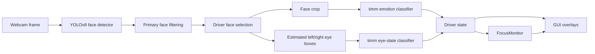
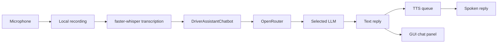

# DriveSense

[English](./README.md) | [Chinese](./README.zh-CN.md)

**DriveSense - Real-time Emotion Detection Chatbot for Drivers**  
**COMPSYS 731, Group 6**

DriveSense is a research prototype for real-time driver-state monitoring and short-form conversational support. It combines webcam-based face analysis, local speech transcription, text-to-speech, and OpenRouter-based LLM replies in a single desktop application.

## Team

- **Peirou Zhang**: emotion classification benchmarking, speech input/output
- **Xiangteng Mao**: LLM benchmarking and model selection, test case design
- **Daniel Shaw**: UI development and system integration

## What The System Does

- Detects faces from the webcam with YOLO.
- Selects the driver face from the visible people.
- Classifies driver emotion into 7 classes:
  `anger`, `disgust`, `fear`, `happy`, `neutral`, `sad`, `surprise`
- Classifies eye state into 2 classes:
  `open_eye`, `closed_eye`
- Raises a focus warning when the driver keeps eyes closed beyond a threshold.
- Supports text chat and voice-triggered chat in the same GUI.
- Uses OpenRouter to compare multiple LLMs behind one API client.

## Current Runtime Design

The live system is intentionally split into separate responsibilities:

- **YOLOv8 face detection** handles localization.
- **timm emotion classifier** handles face-level emotion classification.
- **timm eye classifier** handles eye-state classification on cropped eye regions.
- **FocusMonitor** handles closed-eye timing, warning state, beep, short TTS prompt, and optional voice dialogue.
- **PyQt5 GUI** displays the video, driver state, and chat history.

This keeps detection and classification decoupled and makes model benchmarking easier.

## Vision Pipeline



### Driver selection logic

When multiple faces are visible, the system does **not** use all faces equally.

It first filters out very small / far faces, then selects the driver from the remaining candidates. The current default heuristic is:

- keep only primary face candidates
- choose the **left-most** candidate as the driver

This matches the current project assumption for the demo setup.

### Eye-state logic

Current eye detection is not landmark-based. The system:

1. detects the face
2. estimates left and right eye boxes from the face box geometry
3. crops those eye patches
4. sends the patches to the eye classifier

This is simple and fast, but less precise than a dedicated facial-landmark pipeline.

## Speech And LLM Pipeline



### Important runtime behaviors

- Text input produces **text output + spoken output**.
- Manual voice input produces **transcribed text in the chat panel + text reply in the chat panel + spoken reply**.
- Closed-eye auto intervention also pushes **transcribed text + assistant reply** into the GUI chat panel.
- TTS playback is serialized through a **single global queue** to avoid `pyttsx3` thread-safety issues on Windows.

## OpenRouter / LLM Behavior

The GUI currently supports:

- `openai/gpt-4o-mini`
- `anthropic/claude-haiku-4-5`
- `deepseek/deepseek-chat`

The code uses the `openai` Python package with:

- `base_url = https://openrouter.ai/api/v1`

### Prompt behavior

The chatbot prompt is built from:

- detected emotion
- eye state
- risk level
- focus alert state
- driver-side context
- current interaction mode (`direct reply` vs `auto-triggered check-in`)

Internal file paths such as checkpoint paths are **not** included in the LLM state anymore.

### Provider fallback

If some OpenRouter providers reject a request with `403`, the runtime:

1. retries with a more provider-safe system prompt
2. falls back to `deepseek/deepseek-chat` if needed

## Focus Warning Behavior

When the selected driver keeps eyes closed longer than the configured threshold:

1. the GUI shows a focus warning
2. a beep is played
3. a short TTS prompt is spoken
4. optional voice dialogue starts

The short warning prompt is no longer fully fixed. It now varies by emotion and risk context, for example:

- `Please stay focused. Take a breath.`
- `Please stay focused. Stay calm.`
- `Please stay focused. Are you okay?`
- `Please stay focused. Eyes on the road.`

The focus-monitor state is synchronized before intervention is launched, so the LLM sees the correct `risk` and `focus_alert` values for the triggering frame.

## Repository Structure

```text
G:\731
|-- README.md
|-- README.zh-CN.md
|-- requirements.txt
|-- drivesense/
|   |-- __main__.py
|   |-- frontend/
|   |   |-- gui.py
|   |-- backend/
|   |   |-- vision.py
|   |   |-- chatbot.py
|   |   |-- focus_monitor.py
|   |   |-- speech.py
|   |   |-- tts_queue.py
|   |   |-- voice_chat.py
|   |-- data/
|   |-- training/
|   |-- benchmarks/
|   |-- database/
|   |-- utils/
|-- tests/
|-- dataset/                 # raw datasets, ignored by Git
|-- prepared_datasets/       # generated datasets, ignored by Git
|-- runs_timm/               # training outputs, ignored by Git
|-- weights/                 # detector weights
```

## Datasets

Raw datasets are expected under:

- `dataset/emotion`
- `dataset/eye`
- `dataset/Affectnet-HQ`

Prepared datasets are written to:

- `prepared_datasets/emotion`
- `prepared_datasets/eye`

### Standard label sets

Emotion labels:

- `anger`
- `disgust`
- `fear`
- `happy`
- `neutral`
- `sad`
- `surprise`

Eye labels:

- `closed_eye`
- `open_eye`

If raw images or CSV labels are changed, rerun dataset preparation before training.

## Environment Setup

### 1. Clone the repository

```powershell
git clone https://github.com/CS731-2026/project-1-emotion-aware-chatbot-team-6.git
cd project-1-emotion-aware-chatbot-team-6
```

If you work directly in `G:\731`, that directory is the project root.

### 2. Create a virtual environment

```powershell
py -3.11 -m venv .venv311
.\.venv311\Scripts\activate
python -m pip install --upgrade pip
```

### 3. Install dependencies

Example for CUDA-enabled PyTorch on Windows:

```powershell
python -m pip install torch==2.9.1 torchvision==0.24.1 torchaudio==2.9.1 --index-url https://download.pytorch.org/whl/cu130
python -m pip install -r requirements.txt
```

If CUDA is unavailable, install a CPU build of PyTorch and run with `--device cpu`.

### 4. Configure environment variables

Create a local `.env` file in the repository root:

```env
OPENROUTER_API_KEY=your_openrouter_api_key_here
OPENROUTER_HTTP_REFERER=https://openrouter.ai
```

Do not commit `.env`.

## Preparing Datasets

Run this whenever raw images or label files change:

```powershell
python -m drivesense.data.prepare_dataset --overwrite
```

## Training

### Emotion models

Example:

```powershell
python -m drivesense.training.train_emotion_timm --model-key efficientnet_b0 --epochs 20 --batch-size 32 --img-size 224 --device cuda --overwrite
```

Available `--model-key` values:

- `resnet50`
- `efficientnet_b0`
- `efficientnet_b3`
- `swin_tiny`
- `mobilenet_v2`

### Eye-state model

```powershell
python -m drivesense.training.train_eye_timm --device cuda --overwrite
```

Training outputs are saved under `runs_timm/`, for example:

- `runs_timm/efficientnet_b0/`
- `runs_timm/eye_efficientnet_b0/`

## Benchmark Commands

### Summarize the five timm emotion runs

```powershell
python -m drivesense.benchmarks.summarize_timm_benchmark --run-names resnet50 efficientnet_b0 efficientnet_b3 swin_tiny mobilenet_v2
```

### LLM benchmark

```powershell
python -m drivesense.benchmarks.llm_benchmark
python -m drivesense.benchmarks.score_llm_results --input-csv benchmark_results\llm_benchmark\manual_scores_template.csv
```

### Temperature sweep

```powershell
python -m drivesense.benchmarks.temperature_sweep --model openai/gpt-4o-mini
python -m drivesense.benchmarks.score_llm_results --input-csv benchmark_results\temperature_sweep\manual_scores_template.csv --group-by temperature
```

## Running The System

### GUI

```powershell
python -m drivesense.frontend.gui --device cuda --default-llm-model openai/gpt-4o-mini
```

### CLI vision mode

```powershell
python -m drivesense.backend.vision --device cuda --window-width 1280 --window-height 720
```

### CLI chatbot

```powershell
python -m drivesense.backend.chatbot --model openai/gpt-4o-mini --emotion neutral --temperature 1.0
```

### CLI speech test

```powershell
python -m drivesense.backend.speech --duration 5 --model-size base
```

## GUI Features

- live webcam stream
- face box and eye box overlays
- current driver emotion / eye state / risk display
- LLM model selection
- text chat
- press-and-hold microphone input
- automatic focus-triggered voice intervention
- synchronized chat log for text and voice interactions

## Version Control

Recommended workflow:

1. pull latest `main`
2. create a feature branch
3. make focused commits
4. push the branch
5. open a PR
6. merge after review

Example:

```powershell
git pull origin main
git checkout -b feature/update-focus-monitor
git add .
git commit -m "Improve focus monitor state synchronization"
git push -u origin feature/update-focus-monitor
```

### Do not commit

- `.venv311/`
- `.env`
- `dataset/`
- `prepared_datasets/`
- `runs_timm/`
- large checkpoints such as `*.pth`

Always check `git status` before committing.

## Known Constraints

- This is a prototype, not a production driving system.
- Driver selection is heuristic-based when multiple people appear.
- Eye boxes are geometry-estimated from face boxes, not landmark-detected.
- LLM safety/tone evaluation still includes manual scoring.
- Some OpenRouter providers may reject requests depending on account/provider policy.

## Academic Use

This repository is primarily for COMPSYS 731 coursework and prototype research. Add a dedicated `LICENSE` file if the project needs formal external reuse terms.
