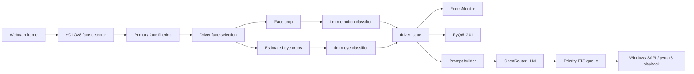
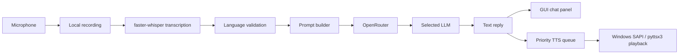

# DriveSense

[English](./README.md) | [中文](./README.zh-CN.md)

**DriveSense - Real-time Emotion Detection Chatbot for Drivers**  
**COMPSYS 731, Group 6**

DriveSense is a desktop research prototype for real-time driver-state monitoring and short-form conversational support. It combines webcam vision, local speech transcription, text-to-speech, and OpenRouter-based LLM replies inside one PyQt5 application.

## Quick Commands

### Activate environment

```powershell
cd G:\731
.\.venv311\Scripts\activate
```

### Run the GUI

```powershell
python -m drivesense.frontend.gui --device cuda
```

### Prepare datasets

```powershell
python -m drivesense.data.prepare_dataset --overwrite
```

### Train the emotion model

```powershell
python -m drivesense.training.train_emotion_timm --model-key efficientnet_b0 --epochs 20 --batch-size 32 --img-size 224 --device cuda --overwrite
```

### Train the eye-state model

```powershell
python -m drivesense.training.train_eye_timm --device cuda --overwrite
```

### Run the LLM benchmark

```powershell
python -m drivesense.benchmarks.llm_benchmark
```

### Package the app as `.exe`

```powershell
G:\731\.venv311\Scripts\pyinstaller.exe G:\731\DriveSense.spec
```

## Team

- **Peirou Zhang**: emotion classification benchmarking, speech input/output
- **Xiangteng Mao**: LLM benchmarking and model selection, test case design
- **Daniel Shaw**: UI development and system integration

## System Goals

The project is optimized for a course demo and comparative experiments, not for production driving deployment.

Primary goals:

- detect the visible driver from a webcam stream
- estimate driver emotion and eye state in real time
- raise a focus warning when closed-eye behavior exceeds a threshold
- support both typed and voice-driven short conversations
- compare multiple LLMs behind one OpenRouter interface

Non-goals for the current prototype:

- identity verification of the driver
- production-grade driver monitoring certification
- full conversational assistant behavior
- landmark-accurate facial analysis

## Technical Stack

### Frontend

- **PyQt5** for the desktop GUI
- real-time video display, state cards, logs, history chart, and model page

### Vision

- **YOLOv8** face detector for localization
- **timm** image classifiers for:
  - 7-class emotion recognition
  - 2-class eye-state recognition
- **OpenCV** for webcam capture and frame conversion

### Voice

- **sounddevice** for microphone recording
- **faster-whisper** for local transcription
- **System.Speech / Windows SAPI** for local TTS on Windows
- **pyttsx3** fallback for non-Windows environments

### LLM

- **OpenRouter** as the unified API gateway
- `openai` Python client configured with:
  - `base_url = https://openrouter.ai/api/v1`

### Training / Benchmarking

- custom Python package modules under `drivesense.training`
- benchmarking utilities under `drivesense.benchmarks`

## High-Level Design Logic

The runtime is intentionally split into simple, testable stages.

Key design choices:

- **YOLO detects, timm classifies**  
  Face localization and emotion classification are separated on purpose. This makes the detector reusable and keeps model benchmarking focused on classification quality.

- **Driver-first logic**  
  The system does not reason about every visible face equally. It filters candidate faces and then selects one driver face using a heuristic, because focus alerts should depend on one driver only.

- **State-first architecture**  
  GUI display, focus monitoring, and LLM prompting all derive from the same `driver_state` object, so the displayed status and the prompt context stay aligned.

- **Short-response interaction model**  
  The assistant is intentionally constrained to short replies because the prototype is designed for driving-like scenarios where long conversations are undesirable.

- **Local speech, remote LLM**  
  Transcription and TTS run locally to reduce dependency count, while LLM generation is remote through OpenRouter to support model comparison.

## Runtime Architecture



## Vision Pipeline

### 1. Face detection

Each frame is sent to the YOLO face detector. The detector returns face boxes and confidence scores.

### 2. Primary face filtering

Very small or far-away faces are filtered out. This avoids background faces dominating the downstream logic.

### 3. Driver face selection

From the remaining candidates, the runtime selects one driver face. The current default heuristic is to choose the left-most candidate after filtering, with lightweight previous-center tracking to reduce frame-to-frame jitter. This matches the current demo setup.

### 4. Emotion classification

The selected face crop is sent to a timm classifier trained on 7 classes:

- `anger`
- `disgust`
- `fear`
- `happy`
- `neutral`
- `sad`
- `surprise`

The runtime also tracks the top predictions and confidence. The first two emotion candidates are passed into the LLM context, and low-confidence `sad` / `anger` predictions below 80% are downgraded to `neutral` before risk logic uses them.

### 5. Eye-state classification

The current eye pipeline is geometry-based rather than landmark-based:

1. detect the face
2. estimate left and right eye regions from the face box
3. crop the eye patches
4. classify them as `open_eye` or `closed_eye`

This is simpler and faster than a facial-landmark solution, but less precise.

## Focus Monitoring Logic

`FocusMonitor` is responsible for converting raw visual predictions into intervention logic.

Current trigger paths:

- **Eye-closure path**
  - ignore eye-state decisions during the GUI warm-up period, default 5 seconds
  - track continuous closed-eye duration for the selected driver only
  - raise a focus warning after the configured threshold, default 2 seconds

- **Emotion path**
  - track sustained negative emotion streaks
  - `anger` / `fear`: 3 seconds, HIGH risk, beep + TTS + voice dialogue
  - `sad`: 3 seconds, MED risk, beep + TTS + voice dialogue
  - `disgust`: 3 seconds, LOW risk, beep + short TTS only
  - `surprise`: 3 seconds, MED risk, beep + short TTS only
  - `happy` / `neutral`: no emotion alert
  - eye and emotion alerts share a default 10-second cooldown

Outputs from `FocusMonitor`:

- GUI warning state
- risk level / focus level
- trigger reason
- beep
- short TTS alert
- optional voice dialogue

Design logic:

- keep time-based state out of the classifier modules
- avoid coupling visual predictions directly to audio/network side effects
- make the warning reason explicit for both the GUI and LLM prompt

## Speech and Conversation Pipeline



### Current interaction rules

- text input produces **text output + spoken output**
- manual voice input produces **transcribed text + assistant text + spoken reply**
- focus-triggered voice dialogue also writes its text results into the GUI chat log
- input and output are restricted to **Chinese and English**
- wake-word listening starts automatically in the GUI and listens for `hey moss`, `hey`, or `moss`
- the push-to-talk button records while pressed

### Concurrency control

The speech pipeline uses explicit coordination because Windows audio/TTS components are not thread-safe enough for uncontrolled parallel access.

Current controls:

- **microphone lock**: prevents multiple threads from opening the microphone stream at once
- **voice-session lock**: prevents overlapping full voice sessions
- **single-consumer TTS queue**: serializes all speech playback
- **priority-based TTS dispatch**:
  - focus alerts > voice-dialogue replies > normal chat replies

Important limitation:

- queued lower-priority jobs can be dropped before playback
- an audio job that has already started playback is not forcefully interrupted

## LLM Prompt Design

The LLM is not used as a raw open-ended chatbot. Replies are constrained by the system prompt.

Prompt inputs include:

- primary and secondary emotion with confidence
- current eye state
- risk level
- focus alert state
- closed-eye duration
- trigger reason
- interaction mode:
  - normal reply
  - auto-triggered check-in

Prompt constraints include:

- reply in at most 2 short sentences
- stay calm and non-alarmist
- follow the detected language
- use the driver state as soft context rather than absolute truth

Internal model paths are sanitized out before state is passed to the LLM.

## OpenRouter Model Strategy

The GUI currently exposes:

- `openai/gpt-4o-mini`
- `anthropic/claude-haiku-4-5`
- `deepseek/deepseek-chat`

Default model:

- `anthropic/claude-haiku-4-5`

Fallback strategy:

1. try the selected model
2. if provider rejects the prompt, retry with a safer prompt
3. if needed, fall back to `deepseek/deepseek-chat`

This lets the project compare multiple LLMs while keeping one consistent code path.

## GUI Design Logic

The GUI is separated into several responsibilities:

- **Dashboard**: live camera, driver state, emotion alert rules, context, and chat
- **Logs**: runtime event trace
- **History**: recent attention score curve with PNG chart export
- **Models**: LLM benchmark comparison

Design logic:

- keep the main driving-state information visible without opening other pages
- expose emotion alert rules and the current emotion timer on the dashboard
- keep experimental outputs separate from the core dashboard
- expose model switching and reply provenance directly in the interface

## Repository Structure

```text
G:\731
|-- README.md
|-- README.zh-CN.md
|-- DriveSense.spec
|-- requirements.txt
|-- drivesense/
|   |-- __main__.py
|   |-- frontend/
|   |   |-- gui.py
|   |-- backend/
|   |   |-- vision.py
|   |   |-- chatbot.py
|   |   |-- focus_monitor.py
|   |   |-- speech.py
|   |   |-- tts_queue.py
|   |   |-- voice_chat.py
|   |   |-- wake_word.py
|   |-- data/
|   |-- training/
|   |-- benchmarks/
|   |-- database/
|   |-- utils/
|-- tests/
|-- dataset/
|-- prepared_datasets/
|-- runs_timm/
|-- weights/
|-- benchmark_results/
```

## Datasets

Expected raw dataset locations:

- `dataset/emotion`
- `dataset/eye`
- `dataset/Affectnet-HQ`

Prepared outputs:

- `prepared_datasets/emotion`
- `prepared_datasets/eye`

Standard label sets:

Emotion:

- `anger`
- `disgust`
- `fear`
- `happy`
- `neutral`
- `sad`
- `surprise`

Eye state:

- `closed_eye`
- `open_eye`

Whenever raw images or CSV labels change, rerun dataset preparation before training.

## Environment Setup

### 1. Clone the repository

```powershell
git clone https://github.com/CS731-2026/project-1-emotion-aware-chatbot-team-6.git
cd project-1-emotion-aware-chatbot-team-6
```

If you work directly in `G:\731`, that directory is the project root.

### 2. Create a virtual environment

```powershell
py -3.11 -m venv .venv311
.\.venv311\Scripts\activate
python -m pip install --upgrade pip
```

### 3. Install dependencies

CUDA-enabled PyTorch example on Windows:

```powershell
python -m pip install torch==2.9.1 torchvision==0.24.1 torchaudio==2.9.1 --index-url https://download.pytorch.org/whl/cu130
python -m pip install -r requirements.txt
```

If CUDA is unavailable, install a CPU build of PyTorch and run with `--device cpu`.

### 4. Configure environment variables

Create a local `.env` file in the repository root:

```env
OPENROUTER_API_KEY=your_openrouter_api_key_here
OPENROUTER_HTTP_REFERER=https://openrouter.ai
```

Do not commit `.env`.

## Training

### Prepare datasets

```powershell
python -m drivesense.data.prepare_dataset --overwrite
```

### Emotion models

```powershell
python -m drivesense.training.train_emotion_timm --model-key efficientnet_b0 --epochs 20 --batch-size 32 --img-size 224 --device cuda --overwrite
```

Available `--model-key` values:

- `resnet50`
- `efficientnet_b0`
- `efficientnet_b3`
- `swin_tiny`
- `mobilenet_v2`

### Eye-state model

```powershell
python -m drivesense.training.train_eye_timm --device cuda --overwrite
```

Training outputs are written under `runs_timm/`.

## Benchmarks

### Summarize the five timm emotion runs

```powershell
python -m drivesense.benchmarks.summarize_timm_benchmark --run-names resnet50 efficientnet_b0 efficientnet_b3 swin_tiny mobilenet_v2
```

### LLM benchmark

```powershell
python -m drivesense.benchmarks.llm_benchmark
python -m drivesense.benchmarks.score_llm_results --input-csv benchmark_results\llm_benchmark\manual_scores_template.csv
```

### Temperature sweep

```powershell
python -m drivesense.benchmarks.temperature_sweep --model openai/gpt-4o-mini
python -m drivesense.benchmarks.score_llm_results --input-csv benchmark_results\temperature_sweep\manual_scores_template.csv --group-by temperature
```

## Running the System

### GUI

```powershell
python -m drivesense.frontend.gui --device cuda --default-llm-model anthropic/claude-haiku-4-5
```

Useful GUI options:

```powershell
python -m drivesense.frontend.gui --device cuda --save-eye-crops
python -m drivesense.frontend.gui --device cpu --no-enable-voice-dialogue
```

`--save-eye-crops` overwrites debug eye crops under `debug_exports/eye_crops/` for inspection. It is disabled by default.

### CLI vision mode

```powershell
python -m drivesense.backend.vision --device cuda --window-width 1280 --window-height 720
```

### CLI chatbot

```powershell
python -m drivesense.backend.chatbot --model anthropic/claude-haiku-4-5 --emotion neutral --temperature 1.0
```

### CLI speech test

```powershell
python -m drivesense.backend.speech --duration 5 --model-size base
```

## Packaging

The project includes a ready-to-use spec file:

- `DriveSense.spec`

Build command:

```powershell
G:\731\.venv311\Scripts\pyinstaller.exe G:\731\DriveSense.spec
```

Output:

- `G:\731\dist\DriveSense\DriveSense.exe`

## Version Control

Recommended workflow:

1. pull latest `main`
2. create a feature branch
3. make focused commits
4. push the branch
5. open a PR
6. merge after review

Example:

```powershell
git pull origin main
git checkout -b feature/update-focus-monitor
git add .
git commit -m "Improve focus monitor state synchronization"
git push -u origin feature/update-focus-monitor
```

Do not commit:

- `.venv311/`
- `.env`
- `dataset/`
- `prepared_datasets/`
- `runs_timm/`
- large checkpoints such as `*.pth`

Always check `git status` before committing.

## Known Constraints

- This is a prototype, not a production driving system.
- Driver selection is heuristic-based when multiple people appear.
- Eye boxes are geometry-estimated rather than landmark-detected.
- Eye crops can be debug-exported, but eye boxes are intentionally not emphasized in the main UI.
- Wake-word detection is a lightweight Whisper-based prototype and can be affected by room noise.
- LLM quality evaluation still includes manual scoring.
- Some OpenRouter providers may reject requests depending on account/provider policy.

## Academic Use

This repository is primarily for COMPSYS 731 coursework and prototype research. Add a dedicated `LICENSE` file if the project needs formal external reuse terms.
