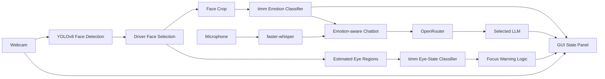

# DriveSense

[English](./README.md) | [Chinese](./README.zh-CN.md)

**DriveSense - Real-time Emotion Detection Chatbot for Drivers**  
**COMPSYS 731, Group 6**

DriveSense is a research-driven driver assistance prototype that combines real-time computer vision, local speech transcription, and LLM-based dialogue support. The system monitors a webcam feed, detects the driver's face, classifies facial emotion and eye state, estimates distraction risk, and responds through a concise in-car chatbot designed to avoid overloading the driver.

## Team

- **Peirou Zhang**: emotion classification benchmarking, speech input/output
- **Xiangteng Mao**: LLM benchmarking and model selection, test case design
- **Daniel Shaw**: UI development and system integration

## Project Goals

- Detect the driver's face in real time.
- Classify facial emotion into 7 classes: `anger`, `disgust`, `fear`, `happy`, `neutral`, `sad`, `surprise`.
- Detect eye state as `open_eye` or `closed_eye`.
- Trigger a focus warning when the driver keeps their eyes closed beyond a threshold.
- Provide short, emotion-aware chatbot responses through OpenRouter.
- Benchmark both vision models and LLMs under controlled settings.

## Technology Stack

### Vision pipeline

- **YOLOv8 face detector**: real-time face localization from webcam frames
- **timm**: image classification backbone library for emotion and eye-state classifiers
- **PyTorch / torchvision**: training, evaluation, augmentation, inference
- **OpenCV**: webcam capture, frame processing, overlays

### Language and speech pipeline

- **OpenRouter**: unified gateway for comparing multiple LLMs
- **openai Python package**: client SDK, configured with OpenRouter `base_url`
- **faster-whisper**: local speech-to-text inference without an external speech API
- **pyttsx3**: local text-to-speech with emotion-aware speech rate adjustment

### Application layer

- **PyQt5**: desktop GUI for webcam monitoring and chat interaction
- **VS Code**: recommended development environment
- **Python 3.11**: recommended interpreter on Windows for PyTorch CUDA support

## Why YOLO + timm

The project uses a split design on purpose:

- **YOLO** is used for **where the face is**.
- **timm models** are used for **what the face/eyes mean**.

This is a cleaner engineering choice than forcing a single detector to do everything. Face detection and emotion classification are different tasks with different optimization targets:

- detection needs fast and stable bounding boxes
- classification needs strong feature extraction and fair backbone comparison

This design also makes benchmarking easier because the same dataset and training settings can be reused across multiple `timm` backbones.

## System Architecture



## Repository Structure

```text
G:\731
|-- requirements.txt
|-- drivesense/
|   |-- __main__.py
|   |-- frontend/
|   |-- backend/
|   |-- data/
|   |-- training/
|   |-- benchmarks/
|   |-- database/
|   |-- utils/
|-- tests/
|-- dataset/                 # raw datasets, ignored by Git
|-- prepared_datasets/       # generated training sets, ignored by Git
|-- runs_timm/               # training outputs, ignored by Git
|-- runs/                    # legacy outputs, ignored by Git
|-- weights/                 # detector weights
```

## Code Organization

- `drivesense/frontend`: GUI layer and user-facing desktop interaction
- `drivesense/backend`: vision, chatbot, and speech runtime logic
- `drivesense/data`: dataset preparation and label repair utilities
- `drivesense/training`: model training entry points
- `drivesense/benchmarks`: vision and LLM evaluation scripts
- `drivesense/database`: reserved storage layer; currently file-based and stateless
- `drivesense/utils`: small utility helpers
- `tests`: smoke tests for package layout and import stability
- `python -m drivesense.<module>`: the only supported way to run project modules

## Datasets

The project expects raw data under `dataset/`. Current data sources include:

- `dataset/emotion`
- `dataset/eye`
- `dataset/Affectnet-HQ`

After preparation, the processed datasets are written to:

- `prepared_datasets/emotion`
- `prepared_datasets/eye`

### Standardized labels

Emotion classes:

- `anger`
- `disgust`
- `fear`
- `happy`
- `neutral`
- `sad`
- `surprise`

Eye-state classes:

- `closed_eye`
- `open_eye`

## Model Benchmark Design

The emotion benchmark compares five backbones under the same training conditions:

- `resnet50`
- `efficientnet_b0`
- `efficientnet_b3`
- `swin_tiny`
- `mobilenet_v2`

Fair comparison rules:

- same dataset split
- same image size
- same epoch count
- same training script
- same evaluation logic
- only the model backbone changes

Outputs include:

- validation accuracy history
- best validation accuracy
- test accuracy
- average inference speed
- summary plots and comparison tables

## LLM Benchmark Design

The chatbot comparison currently targets:

- `openai/gpt-4o-mini`
- `anthropic/claude-haiku-4-5`
- `deepseek/deepseek-chat`

Evaluation dimensions:

- response latency
- manual safety/tone quality score
- usage cost

Fixed scenarios are used so all models are tested under the same prompts and emotional context.

## Environment Setup

### 1. Clone the repository

```powershell
git clone https://github.com/CS731-2026/project-1-emotion-aware-chatbot-team-6.git
cd project-1-emotion-aware-chatbot-team-6
```

If you are working directly in `G:\731`, use that directory as the repository root.

### 2. Create a virtual environment

```powershell
py -3.11 -m venv .venv311
.\.venv311\Scripts\activate
python -m pip install --upgrade pip
```

### 3. Install dependencies

For CUDA-enabled PyTorch on Windows:

```powershell
python -m pip install torch==2.9.1 torchvision==0.24.1 torchaudio==2.9.1 --index-url https://download.pytorch.org/whl/cu130
python -m pip install -r requirements.txt
```

If CUDA is unavailable, install the CPU version of PyTorch and run training with `--device cpu`.

### 4. Configure environment variables

Create a local `.env` file in the repository root:

```env
OPENROUTER_API_KEY=your_openrouter_api_key_here
OPENROUTER_HTTP_REFERER=https://openrouter.ai
```

The `.env` file is ignored by Git and should never be committed.

## Preparing the Datasets

Before training, prepare the datasets into the unified folder structure:

```powershell
python -m drivesense.data.prepare_dataset --overwrite
```

This step is required whenever the raw dataset is changed or relabeled.

## Training

### Emotion classification

Example:

```powershell
python -m drivesense.training.train_emotion_timm --model-key efficientnet_b0 --epochs 20 --batch-size 32 --img-size 224 --device cuda --overwrite
```

Available `--model-key` values:

- `resnet50`
- `efficientnet_b0`
- `efficientnet_b3`
- `swin_tiny`
- `mobilenet_v2`

### Eye-state classification

```powershell
python -m drivesense.training.train_eye_timm --device cuda --overwrite
```

Training outputs are stored under `runs_timm/`, for example:

- `runs_timm/efficientnet_b0/`
- `runs_timm/eye_efficientnet_b0/`

Each run typically includes:

- `best_model.pth`
- `last_model.pth`
- `metadata.json`
- logs and plots

## Benchmark Summary

After finishing the five emotion runs:

```powershell
python -m drivesense.benchmarks.summarize_timm_benchmark --run-names resnet50 efficientnet_b0 efficientnet_b3 swin_tiny mobilenet_v2
```

## Real-Time Webcam Monitoring

### CLI mode

```powershell
python -m drivesense.backend.vision --device cuda --window-width 1280 --window-height 720
```

Behavior:

- green box: face and emotion
- blue box: eye regions and eye state
- warning text appears when the selected driver keeps eyes closed for too long
- optional per-frame emotion top-3 probabilities can be printed for debugging

### GUI mode

```powershell
python -m drivesense.frontend.gui --device cuda --default-llm-model openai/gpt-4o-mini
```

GUI features:

- live webcam display
- current emotion and risk level
- OpenRouter LLM selection
- text chat interface
- press-and-hold microphone recording
- background-thread execution to avoid UI freezes

## Chatbot Usage

### CLI chatbot

```powershell
python -m drivesense.backend.chatbot --model openai/gpt-4o-mini --emotion anger --temperature 1.0
```

Design principles:

- reply in at most 2 to 3 short sentences
- stay calm and non-alarmist
- adapt tone to the detected emotion
- minimize distraction while driving

## Speech-to-Text

```powershell
python -m drivesense.backend.speech --duration 5 --model-size base
```

This runs `faster-whisper` locally and does not require an external speech API.

## LLM Benchmark Commands

```powershell
python -m drivesense.benchmarks.llm_benchmark
python -m drivesense.benchmarks.score_llm_results --input-csv benchmark_results\llm_benchmark\manual_scores_template.csv
```

Temperature follow-up experiment:

```powershell
python -m drivesense.benchmarks.temperature_sweep --model openai/gpt-4o-mini
python -m drivesense.benchmarks.score_llm_results --input-csv benchmark_results\temperature_sweep\manual_scores_template.csv --group-by temperature
```

## Version Control and Collaboration

This project is intended for team collaboration. Follow a basic Git workflow instead of pushing directly from unreviewed local experiments.

### Recommended workflow

1. Pull the latest changes.
2. Create a feature branch.
3. Make focused commits.
4. Push the branch to GitHub.
5. Open a Pull Request.
6. Review and merge after confirmation.

Example:

```powershell
git pull origin main
git checkout -b feature/update-gui-warning
git add .
git commit -m "Improve driver warning overlay placement"
git push -u origin feature/update-gui-warning
```

### What should not be committed

Do **not** commit:

- virtual environments such as `.venv311/`
- `.env`
- raw datasets under `dataset/`
- processed datasets under `prepared_datasets/`
- training outputs under `runs/` and `runs_timm/`
- large checkpoint files such as `*.pth`

These paths are already covered in `.gitignore`, but contributors should still check `git status` before committing.

### Commit style guidance

- Keep one logical change per commit.
- Use clear commit messages.
- Avoid mixing dataset edits, model outputs, and source code changes in one commit.
- Re-run the relevant script before pushing if your change affects training or inference behavior.

## Reproducibility Notes

- Run `prepare_dataset.py` after changing raw data.
- Use the same benchmark settings when comparing models.
- Keep model checkpoints out of Git history.
- Prefer storing final trained weights externally if they exceed GitHub size limits.

## Known Constraints

- Real driving deployment is out of scope; this is a prototype and research project.
- Webcam-based face selection is heuristic when multiple people appear.
- Eye regions are estimated geometrically from face boxes rather than detected by a dedicated landmark model.
- LLM quality scoring still includes manual evaluation.

## License and Academic Use

This repository is for COMPSYS 731 coursework and research prototyping. If a formal license is needed for external reuse, add a dedicated `LICENSE` file and align it with course or team requirements.
