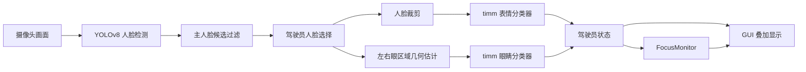
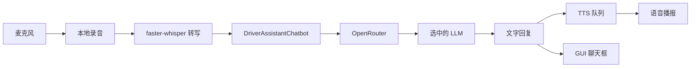

# DriveSense

[English](./README.md) | [中文](./README.zh-CN.md)

**DriveSense - 面向驾驶员的实时情绪检测聊天机器人**  
**COMPSYS 731，第 6 组**

DriveSense 是一个课程研究原型系统，用于实时驾驶员状态监测与简短对话辅助。系统把摄像头视觉、语音转文字、文字转语音和基于 OpenRouter 的大语言模型整合到同一个桌面应用中。

## 组员分工

- **Peirou Zhang**：表情分类模型对比、语音输入输出
- **Xiangteng Mao**：LLM 对比与选择、测试用例设计
- **Daniel Shaw**：UI 开发与系统集成

## 系统当前功能

- 使用 YOLO 从摄像头画面中检测人脸
- 在多人场景下选择驾驶员对应的人脸
- 将驾驶员表情分为 7 类：
  `anger`、`disgust`、`fear`、`happy`、`neutral`、`sad`、`surprise`
- 将眼睛状态分为 2 类：
  `open_eye`、`closed_eye`
- 当驾驶员闭眼持续超过阈值时触发专注提醒
- 在 GUI 中同时支持文字聊天和语音聊天
- 通过 OpenRouter 统一接入多个 LLM

## 当前运行架构

系统按职责拆分为几个部分：

- **YOLOv8 人脸检测**：负责定位人脸
- **timm 表情分类器**：负责对人脸做表情分类
- **timm 眼睛分类器**：负责对裁剪出的眼部区域做睁眼/闭眼分类
- **FocusMonitor**：负责闭眼计时、专注提醒、蜂鸣、短句 TTS 和可选语音对话
- **PyQt5 GUI**：负责实时画面、状态信息和聊天界面

这种拆分让检测和分类解耦，也更方便做模型对比实验。

## 视觉流程



### 驾驶员选择逻辑

当前系统不会把所有人脸一视同仁处理。

它会先过滤掉明显太小、太远的人脸，再从候选里选出驾驶员。当前默认规则是：

- 先保留“主要人脸候选”
- 再从中选择**画面最左边**的人脸作为 driver

这和当前演示环境的假设一致。

### 眼睛检测逻辑

当前眼睛检测还不是关键点方案。实际逻辑是：

1. 先检测人脸
2. 根据人脸框几何比例估计左右眼区域
3. 裁剪出左右眼 patch
4. 送入眼睛分类模型

这个方案实现简单、速度快，但精度不如专门的人脸关键点方法。

## 语音与 LLM 流程



### 当前运行行为

- 文字输入会得到：**文字回复 + 语音播报**
- 手动语音输入会得到：**转写文本显示到聊天框 + 回复文本显示到聊天框 + 语音播报**
- 闭眼自动触发语音干预时，也会把：**转写文本 + 模型回复** 同步显示到 GUI 聊天框
- 所有 TTS 播放统一走**全局单消费者队列**，避免 Windows 下 `pyttsx3` 多线程抢锁

## OpenRouter 与 LLM

GUI 当前支持以下模型：

- `openai/gpt-4o-mini`
- `anthropic/claude-haiku-4-5`
- `deepseek/deepseek-chat`

代码使用 `openai` Python 包，并把：

- `base_url` 设为 `https://openrouter.ai/api/v1`

### Prompt 构造

当前 prompt 会基于以下信息构造：

- 当前检测到的情绪
- 眼睛状态
- 风险等级
- `focus_alert` 状态
- `driver_side`
- 当前是“正常回复”还是“自动触发 check-in”

内部模型路径这类信息已经不会再传给 LLM。

### Provider 回退逻辑

如果某些 OpenRouter provider 返回 `403`，当前运行时会：

1. 先改用更保守的 provider-safe prompt 重试
2. 如果仍然被拒绝，则回退到 `deepseek/deepseek-chat`

## 专注提醒逻辑

当选中的驾驶员闭眼持续超过阈值时，系统会：

1. 在 GUI 中显示专注提醒
2. 播放蜂鸣音
3. 播放一条简短 TTS 提示
4. 可选地启动完整语音对话流程

现在这条 TTS 提示不再完全写死，而是会根据当前情绪和风险生成短句，例如：

- `Please stay focused. Take a breath.`
- `Please stay focused. Stay calm.`
- `Please stay focused. Are you okay?`
- `Please stay focused. Eyes on the road.`

另外，`FocusMonitor` 触发干预前已经会同步更新 `risk` 和 `focus_alert`，所以 LLM 看到的是正确的疲劳场景状态，不会再出现“实际上在闭眼告警，但 prompt 里还是正常状态”的时序错位。

## 项目结构

```text
G:\731
|-- README.md
|-- README.zh-CN.md
|-- requirements.txt
|-- drivesense/
|   |-- __main__.py
|   |-- frontend/
|   |   |-- gui.py
|   |-- backend/
|   |   |-- vision.py
|   |   |-- chatbot.py
|   |   |-- focus_monitor.py
|   |   |-- speech.py
|   |   |-- tts_queue.py
|   |   |-- voice_chat.py
|   |-- data/
|   |-- training/
|   |-- benchmarks/
|   |-- database/
|   |-- utils/
|-- tests/
|-- dataset/                 # 原始数据，Git 忽略
|-- prepared_datasets/       # 预处理数据，Git 忽略
|-- runs_timm/               # 训练输出，Git 忽略
|-- weights/                 # 检测模型权重
```

## 数据集

原始数据默认放在：

- `dataset/emotion`
- `dataset/eye`
- `dataset/Affectnet-HQ`

预处理后的数据输出到：

- `prepared_datasets/emotion`
- `prepared_datasets/eye`

### 标准标签集合

表情标签：

- `anger`
- `disgust`
- `fear`
- `happy`
- `neutral`
- `sad`
- `surprise`

眼睛标签：

- `closed_eye`
- `open_eye`

只要原始图片或 CSV 标签有变化，就应该重新运行数据准备脚本。

## 环境搭建

### 1. 拉取仓库

```powershell
git clone https://github.com/CS731-2026/project-1-emotion-aware-chatbot-team-6.git
cd project-1-emotion-aware-chatbot-team-6
```

如果你直接在 `G:\731` 工作，那么它就是项目根目录。

### 2. 创建虚拟环境

```powershell
py -3.11 -m venv .venv311
.\.venv311\Scripts\activate
python -m pip install --upgrade pip
```

### 3. 安装依赖

Windows + CUDA 示例：

```powershell
python -m pip install torch==2.9.1 torchvision==0.24.1 torchaudio==2.9.1 --index-url https://download.pytorch.org/whl/cu130
python -m pip install -r requirements.txt
```

如果没有 CUDA，就安装 CPU 版本 PyTorch，并在运行时使用 `--device cpu`。

### 4. 配置环境变量

在仓库根目录创建本地 `.env` 文件：

```env
OPENROUTER_API_KEY=your_openrouter_api_key_here
OPENROUTER_HTTP_REFERER=https://openrouter.ai
```

不要提交 `.env`。

## 数据准备

当原始数据或标签文件发生变化后，运行：

```powershell
python -m drivesense.data.prepare_dataset --overwrite
```

## 模型训练

### 表情分类训练

示例：

```powershell
python -m drivesense.training.train_emotion_timm --model-key efficientnet_b0 --epochs 20 --batch-size 32 --img-size 224 --device cuda --overwrite
```

可选 `--model-key`：

- `resnet50`
- `efficientnet_b0`
- `efficientnet_b3`
- `swin_tiny`
- `mobilenet_v2`

### 眼睛状态训练

```powershell
python -m drivesense.training.train_eye_timm --device cuda --overwrite
```

训练输出默认放在 `runs_timm/`，例如：

- `runs_timm/efficientnet_b0/`
- `runs_timm/eye_efficientnet_b0/`

## Benchmark 命令

### 汇总 5 个 timm 表情模型实验

```powershell
python -m drivesense.benchmarks.summarize_timm_benchmark --run-names resnet50 efficientnet_b0 efficientnet_b3 swin_tiny mobilenet_v2
```

### LLM 对比实验

```powershell
python -m drivesense.benchmarks.llm_benchmark
python -m drivesense.benchmarks.score_llm_results --input-csv benchmark_results\llm_benchmark\manual_scores_template.csv
```

### 温度实验

```powershell
python -m drivesense.benchmarks.temperature_sweep --model openai/gpt-4o-mini
python -m drivesense.benchmarks.score_llm_results --input-csv benchmark_results\temperature_sweep\manual_scores_template.csv --group-by temperature
```

## 运行方式

### GUI

```powershell
python -m drivesense.frontend.gui --device cuda
```

### 命令行视觉模式

```powershell
python -m drivesense.backend.vision --device cuda --window-width 1280 --window-height 720
```

### 命令行聊天

```powershell
python -m drivesense.backend.chatbot --model openai/gpt-4o-mini --emotion neutral --temperature 1.0
```

### 语音测试

```powershell
python -m drivesense.backend.speech --duration 5 --model-size base
```

## GUI 功能概览

- 实时摄像头画面
- 人脸框、眼睛框叠加显示
- 驾驶员情绪 / 眼睛状态 / 风险等级显示
- LLM 模型切换
- 文字聊天
- 按住说话的麦克风输入
- 自动疲劳语音干预
- 文字和语音统一写入聊天框

## 版本控制

推荐流程：

1. 先拉取最新 `main`
2. 新建功能分支
3. 小步提交
4. 推送分支
5. 发起 PR
6. Review 后合并

示例：

```powershell
git pull origin main
git checkout -b feature/update-focus-monitor
git add .
git commit -m "Improve focus monitor state synchronization"
git push -u origin feature/update-focus-monitor
```

### 不要提交这些内容

- `.venv311/`
- `.env`
- `dataset/`
- `prepared_datasets/`
- `runs_timm/`
- `*.pth` 这类大模型权重

提交前先检查 `git status`。

## 当前限制

- 这是课程原型，不是实际车载生产系统
- 多人场景下的 driver 选择仍然是启发式规则
- 眼睛区域来自人脸框几何估计，不是关键点检测
- LLM 质量评估仍然包含人工评分
- 某些 OpenRouter provider 可能因为账户或策略原因拒绝请求

## 课程与使用说明

本仓库主要用于 COMPSYS 731 课程项目和原型研究。如需正式对外复用，请补充单独的 `LICENSE` 文件。
