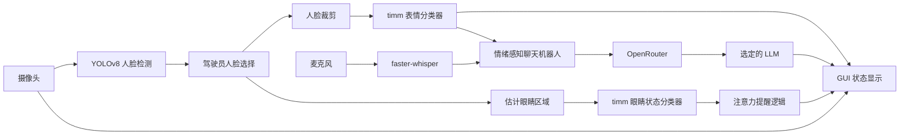

# DriveSense

[English](./README.md) | [Chinese](./README.zh-CN.md)

**DriveSense - 面向驾驶员的实时情绪检测聊天机器人**  
**COMPSYS 731，第 6 组**

DriveSense 是一个面向课程研究的驾驶辅助原型系统，结合了实时计算机视觉、本地语音转写和基于大语言模型的对话支持。系统通过摄像头监测驾驶员，检测人脸，识别面部情绪和眼睛状态，估计注意力风险，并通过尽量简短、不打扰驾驶的聊天机器人进行交互。

## 组员分工

- **Peirou Zhang**：表情分类模型对比、语音输入输出
- **Xiangteng Mao**：大语言模型对比与选择、测试用例设计
- **Daniel Shaw**：UI 界面与系统集成

## 项目目标

- 实时检测驾驶员人脸
- 将面部表情分类为 7 类：`anger`、`disgust`、`fear`、`happy`、`neutral`、`sad`、`surprise`
- 将眼睛状态分类为 `open_eye` 或 `closed_eye`
- 当驾驶员闭眼持续超过阈值时触发注意力提醒
- 通过 OpenRouter 提供简短、带情绪适配能力的聊天回复
- 在统一设置下对视觉模型和 LLM 做对比实验

## 技术栈

### 视觉部分

- **YOLOv8 人脸检测**：用于从摄像头画面中实时定位人脸
- **timm**：作为表情分类与眼睛状态分类的骨干网络库
- **PyTorch / torchvision**：训练、评估、数据增强与推理
- **OpenCV**：摄像头读取、图像处理与可视化叠加

### 语言与语音部分

- **OpenRouter**：统一调用和比较多个 LLM
- **openai Python 包**：客户端 SDK，通过修改 `base_url` 接入 OpenRouter
- **faster-whisper**：本地语音转文字，不依赖外部语音 API

### 应用层

- **PyQt5**：桌面 GUI
- **VS Code**：推荐开发环境
- **Python 3.11**：Windows 上较适合配合 PyTorch CUDA 使用

## 为什么采用 YOLO + timm

这里采用的是刻意拆分的架构：

- **YOLO** 负责 **检测人脸位置**
- **timm 模型** 负责 **识别人脸/眼睛的语义类别**

这比让单一模型同时做所有事情更合理。原因是人脸检测和表情分类本质上是两个不同任务：

- 检测任务强调框的位置稳定和速度
- 分类任务强调特征提取能力和公平的 backbone 对比

同时，这种设计也更利于实验，因为可以在相同数据集和相同训练设置下，公平比较多个 `timm` backbone。

## 系统架构



## 项目结构

```text
G:\731
|-- requirements.txt
|-- drivesense/
|   |-- __main__.py
|   |-- frontend/
|   |-- backend/
|   |-- data/
|   |-- training/
|   |-- benchmarks/
|   |-- database/
|   |-- utils/
|-- tests/
|-- dataset/                 # 原始数据集，Git 忽略
|-- prepared_datasets/       # 处理后的数据集，Git 忽略
|-- runs_timm/               # 训练输出，Git 忽略
|-- runs/                    # 历史输出，Git 忽略
|-- weights/                 # 检测模型权重
```

## 代码结构说明

- `drivesense/frontend`：前端 GUI 层
- `drivesense/backend`：视觉、聊天、语音等后端运行逻辑
- `drivesense/data`：数据准备与标签修复脚本
- `drivesense/training`：模型训练入口
- `drivesense/benchmarks`：视觉与 LLM 的实验评估脚本
- `drivesense/database`：预留的数据存储层，目前项目仍是无持久化、文件式结构
- `drivesense/utils`：通用小工具
- `tests`：最小化 smoke test，用于检查包结构和导入是否正常
- `python -m drivesense.<module>`：项目唯一推荐的运行方式

## 数据集说明

项目默认从 `dataset/` 读取原始数据。目前包括：

- `dataset/emotion`
- `dataset/eye`
- `dataset/Affectnet-HQ`

经过处理后，输出到：

- `prepared_datasets/emotion`
- `prepared_datasets/eye`

### 标准化标签

情绪类别：

- `anger`
- `disgust`
- `fear`
- `happy`
- `neutral`
- `sad`
- `surprise`

眼睛状态类别：

- `closed_eye`
- `open_eye`

## 模型对比实验设计

情绪分类部分当前比较 5 个 backbone：

- `resnet50`
- `efficientnet_b0`
- `efficientnet_b3`
- `swin_tiny`
- `mobilenet_v2`

公平对比原则：

- 使用相同的数据集划分
- 使用相同的输入尺寸
- 使用相同的 epoch 数
- 使用相同训练脚本
- 使用相同评估逻辑
- 唯一变化的是模型 backbone

输出结果包括：

- 验证集精度曲线
- 最佳验证精度
- 测试集精度
- 平均推理速度
- 汇总表和对比图

## LLM 对比实验设计

当前聊天模型对比对象：

- `openai/gpt-4o-mini`
- `anthropic/claude-haiku-4-5`
- `deepseek/deepseek-chat`

评估维度：

- 响应延迟
- 人工安全语气评分
- 使用成本

所有模型使用固定测试场景，以保证对比公平。

## 环境搭建

### 1. 拉取仓库

```powershell
git clone https://github.com/CS731-2026/project-1-emotion-aware-chatbot-team-6.git
cd project-1-emotion-aware-chatbot-team-6
```

如果你直接使用 `G:\731` 作为工作目录，那么它就是仓库根目录。

### 2. 创建虚拟环境

```powershell
py -3.11 -m venv .venv311
.\.venv311\Scripts\activate
python -m pip install --upgrade pip
```

### 3. 安装依赖

Windows + CUDA 版本示例：

```powershell
python -m pip install torch==2.9.1 torchvision==0.24.1 torchaudio==2.9.1 --index-url https://download.pytorch.org/whl/cu130
python -m pip install -r requirements.txt
```

如果没有 CUDA，则安装 CPU 版本 PyTorch，并在训练时使用 `--device cpu`。

### 4. 配置环境变量

在仓库根目录创建本地 `.env` 文件：

```env
OPENROUTER_API_KEY=your_openrouter_api_key_here
OPENROUTER_HTTP_REFERER=https://openrouter.ai
```

`.env` 已被 Git 忽略，不应提交。

## 数据准备

在训练前，需要先将原始数据处理成统一格式：

```powershell
python -m drivesense.data.prepare_dataset --overwrite
```

只要原始数据发生变化或标签有调整，就应重新运行这一步。

## 训练方式

### 表情分类训练

示例：

```powershell
python -m drivesense.training.train_emotion_timm --model-key efficientnet_b0 --epochs 20 --batch-size 32 --img-size 224 --device cuda --overwrite
```

可选 `--model-key`：

- `resnet50`
- `efficientnet_b0`
- `efficientnet_b3`
- `swin_tiny`
- `mobilenet_v2`

### 眼睛状态训练

```powershell
python -m drivesense.training.train_eye_timm --device cuda --overwrite
```

训练输出默认保存在 `runs_timm/`，例如：

- `runs_timm/efficientnet_b0/`
- `runs_timm/eye_efficientnet_b0/`

每个 run 通常包含：

- `best_model.pth`
- `last_model.pth`
- `metadata.json`
- 日志和图表

## Benchmark 汇总

当 5 个情绪模型都训练完后：

```powershell
python -m drivesense.benchmarks.summarize_timm_benchmark --run-names resnet50 efficientnet_b0 efficientnet_b3 swin_tiny mobilenet_v2
```

## 实时摄像头识别

### 命令行模式

```powershell
python -m drivesense.backend.vision --device cuda --window-width 1280 --window-height 720
```

运行效果：

- 绿色框：人脸和表情
- 蓝色框：眼睛区域和眼睛状态
- 驾驶员闭眼持续过久时显示提醒
- 可以按需打印每帧 emotion 的 top-3 概率用于调试

### GUI 模式

```powershell
python -m drivesense.frontend.gui --device cuda --default-llm-model openai/gpt-4o-mini
```

GUI 包含：

- 实时摄像头画面
- 当前情绪和风险等级
- OpenRouter 模型切换
- 文本聊天界面
- 按住录音按钮
- 后台线程处理，避免界面卡死

## Chatbot 使用方式

### 命令行聊天

```powershell
python -m drivesense.backend.chatbot --model openai/gpt-4o-mini --emotion anger --temperature 1.0
```

设计原则：

- 回复最多 2 到 3 句话
- 语气冷静，不制造恐慌
- 根据当前情绪调整回复风格
- 尽量减少对驾驶注意力的干扰

## 语音转文字

```powershell
python -m drivesense.backend.speech --duration 5 --model-size base
```

该脚本本地运行 `faster-whisper`，不依赖外部语音 API。

## LLM Benchmark 命令

```powershell
python -m drivesense.benchmarks.llm_benchmark
python -m drivesense.benchmarks.score_llm_results --input-csv benchmark_results\llm_benchmark\manual_scores_template.csv
```

温度实验：

```powershell
python -m drivesense.benchmarks.temperature_sweep --model openai/gpt-4o-mini
python -m drivesense.benchmarks.score_llm_results --input-csv benchmark_results\temperature_sweep\manual_scores_template.csv --group-by temperature
```

## 版本控制与协作

这个项目适合多人协作，不建议把实验性改动直接推送到主分支。

### 推荐流程

1. 先拉取最新代码
2. 创建功能分支
3. 做聚焦的小提交
4. 推送到 GitHub
5. 发起 Pull Request
6. 通过 review 后再合并

示例：

```powershell
git pull origin main
git checkout -b feature/update-gui-warning
git add .
git commit -m "Improve driver warning overlay placement"
git push -u origin feature/update-gui-warning
```

### 不应提交的内容

不要提交：

- 虚拟环境目录，例如 `.venv311/`
- `.env`
- `dataset/` 下的原始数据
- `prepared_datasets/` 下的处理后数据
- `runs/` 与 `runs_timm/` 下的训练产物
- `*.pth` 这类大模型文件

这些路径已经在 `.gitignore` 中处理，但提交前仍应检查 `git status`。

### Commit 建议

- 一个 commit 只做一类逻辑变更
- commit message 要清晰
- 不要把数据、模型产物和代码改动混在同一次提交中
- 如果改动影响训练或推理行为，推送前应重新运行相关脚本进行验证

## 可复现性说明

- 原始数据有变更时要重新运行 `prepare_dataset.py`
- 做模型对比时保持相同训练设置
- 不要把模型权重写入 Git 历史
- 超过 GitHub 限制的大权重应外部存储

## 当前限制

- 该项目是原型系统，不是实际车载部署方案
- 当画面中出现多人时，驾驶员选择仍依赖启发式规则
- 眼睛区域是根据人脸框几何估计的，并非独立关键点检测
- LLM 回复质量评估仍包含人工打分

## 课程与许可说明

该仓库主要用于 COMPSYS 731 课程项目和研究原型。如果后续需要对外发布，建议单独添加 `LICENSE` 文件，并与课程要求及小组共识保持一致。
