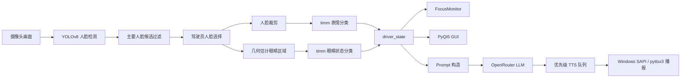
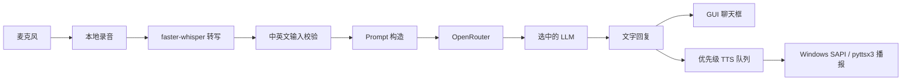

# DriveSense

[English](./README.md) | [中文](./README.zh-CN.md)

**DriveSense - 面向驾驶员的实时情绪检测聊天助手**  
**COMPSYS 731, Group 6**

DriveSense 是一个面向课程 Demo 和实验对比的桌面原型系统。它把摄像头视觉检测、本地语音转写、本地语音播报，以及通过 OpenRouter 调用的大语言模型回复整合到一个 PyQt5 应用中。

## 常用命令

### 激活环境

```powershell
cd G:\731
.\.venv311\Scripts\activate
```

### 启动 GUI

```powershell
python -m drivesense.frontend.gui --device cuda
```

### 准备数据集

```powershell
python -m drivesense.data.prepare_dataset --overwrite
```

### 训练表情模型

```powershell
python -m drivesense.training.train_emotion_timm --model-key efficientnet_b0 --epochs 20 --batch-size 32 --img-size 224 --device cuda --overwrite
```

### 训练眼睛状态模型

```powershell
python -m drivesense.training.train_eye_timm --device cuda --overwrite
```

### 运行 LLM 对比实验

```powershell
python -m drivesense.benchmarks.llm_benchmark
```

### 打包生成 `.exe`

```powershell
G:\731\.venv311\Scripts\pyinstaller.exe G:\731\DriveSense.spec
```

## 组员分工

- **Peirou Zhang**：表情分类模型对比、语音输入输出
- **Xiangteng Mao**：LLM 对比与模型选择、测试用例设计
- **Daniel Shaw**：UI 界面开发与系统集成

## 项目目标

当前项目是课程原型，不是量产车载系统。核心目标是：

- 从摄像头画面中检测驾驶员人脸
- 实时估计驾驶员表情和眼睛状态
- 当驾驶员持续闭眼超过阈值时触发专注提醒
- 支持文字输入和语音输入两种对话方式
- 通过 OpenRouter 用同一套接口对比多个 LLM

当前非目标：

- 驾驶员身份验证
- 量产级车载安全认证
- 长对话式通用助手
- 基于人脸关键点的高精度眼部定位

## 技术栈

### 前端

- **PyQt5**：桌面 GUI
- Dashboard、Logs、History、Models 多页面界面
- 实时摄像头画面、驾驶员状态卡、聊天区、注意力曲线、模型对比表

### 视觉

- **YOLOv8**：人脸检测
- **timm**：图像分类模型
- **OpenCV**：摄像头读取、帧处理和图像绘制

表情分类为 7 类：

- `anger`
- `disgust`
- `fear`
- `happy`
- `neutral`
- `sad`
- `surprise`

眼睛状态分类为 2 类：

- `closed_eye`
- `open_eye`

### 语音

- **sounddevice**：本地麦克风录音
- **faster-whisper**：本地语音转写
- **System.Speech / Windows SAPI**：Windows 本地 TTS 播报
- **pyttsx3**：非 Windows 环境的 TTS fallback

### LLM

- **OpenRouter**：统一的大模型 API 网关
- **openai Python SDK**：通过 `base_url = https://openrouter.ai/api/v1` 调用 OpenRouter

GUI 当前支持的模型：

- `openai/gpt-4o-mini`
- `anthropic/claude-haiku-4-5`
- `deepseek/deepseek-chat`

默认模型：

- `anthropic/claude-haiku-4-5`

## 系统架构



## 关键设计逻辑

- **YOLO 负责检测，timm 负责分类**  
  人脸定位和表情分类被拆开，这样检测器可以复用，表情模型也方便公平对比。

- **只关注主驾驶员**  
  多人出现在画面中时，系统不会让所有人脸共同影响风险判断。代码会先过滤太小、太远的人脸，再选择一个驾驶员人脸。

- **统一 driver_state**  
  GUI 展示、FocusMonitor 告警和 LLM prompt 都从同一个 `driver_state` 派生，避免 UI 显示和 LLM 看到的状态不一致。

- **短回复交互**  
  Prompt 限制 LLM 最多回复 2 到 3 句，避免驾驶场景下长时间分散注意力。

- **本地语音，远程 LLM**  
  录音、转写和播报尽量在本地完成；LLM 通过 OpenRouter 远程调用，便于做多模型对比。

## 视觉流程

### 1. 人脸检测

每帧画面会送入 YOLOv8 人脸检测器，得到人脸框和置信度。

### 2. 主要人脸过滤

系统会过滤掉画面中明显太小或太远的人脸，避免背景人脸影响驾驶员判断。

### 3. 驾驶员选择

默认策略是从候选人脸里选择画面最左侧的人脸作为 driver。代码也保留了 `center`、`right`、`largest` 等策略参数。系统会使用上一帧 driver 中心位置做轻量跟踪，减少单帧抖动。

### 4. 表情分类

选中的 driver 人脸裁剪后送入 timm 表情分类器。当前会保留前两名表情及置信度，并把它们传给 LLM prompt。运行时还有一个后处理规则：低于 60% 置信度的 `sad` 和 `anger` 会被降级为 `neutral`。

### 5. 眼睛状态分类

当前眼部区域不是关键点检测，而是基于人脸框的几何比例估计：

1. 检测人脸
2. 根据人脸框估算左右眼区域
3. 裁剪眼睛 patch
4. 送入 timm 眼睛分类器

这套方案速度快、实现简单，但精度不如 landmark-based 方法。默认 UI 不强调显示眼睛框；如需调试裁剪结果，可用 `--save-eye-crops` 保存本次运行的眼部裁剪图。

## FocusMonitor 告警逻辑

`FocusMonitor` 负责把视觉预测转换成提醒逻辑。

### 闭眼路径

- GUI 启动后默认先等待 5 秒眼睛状态 warm-up
- 只统计 driver 的闭眼状态，不看其他人脸
- driver 连续闭眼达到默认 2 秒后触发 `beep + 固定 TTS`
- 固定闭眼播报内容为：`Hey, Eye closed detected. Are you feeling tired?`
- 闭眼路径不启动后续录音，也不进入语音对话
- `Eye Monitoring` 按钮可以关闭闭眼干预；关闭后仍显示眼睛分类结果，但不触发闭眼风险、focus alert、beep 或 TTS

### 情绪路径

持续负面情绪会触发分层提醒：

- `fear`：持续 3 秒，HIGH risk，beep + TTS + 5 秒首轮语音对话
- `sad`：持续 3 秒，MED risk，beep + TTS + 5 秒首轮语音对话
- `disgust`：持续 3 秒，LOW risk，beep + TTS + 5 秒首轮语音对话
- `anger`：持续 3 秒，HIGH risk，beep + 短句 TTS，不启动录音对话
- `surprise`：持续 3 秒，MED risk，beep + 短句 TTS，不启动录音对话
- `happy` / `neutral`：不触发表情告警
- 闭眼告警和情绪告警共享默认 10 秒 cooldown
- 自动情绪对话串行处理；当前 dialogue 未结束时，新的情绪触发会被丢弃，不排队
- 每次助手回复播报后，系统继续监听 3 秒 follow-up；如果检测到后续语音就继续下一轮，直到 3 秒内没有后续语音

Dashboard 中的 `Emotion Alert Rules` 卡片展示这些规则，`Emotion timer` 展示当前情绪已经持续多久以及距离触发还有多久。

## 语音和对话流程



当前交互规则：

- 文字输入会得到文字回复和语音播报
- 手动语音输入会把转写文本和回复都写入聊天框，并播报回复
- 所有用户输入在程序拿到文本后都会立即显示到聊天框
- 用户输入显示后会立即插入 `...` 助手占位；模型回复到达后原地替换这个占位
- 自动情绪语音对话也会把每轮转写文本和模型回复写入聊天框
- 语音和文字输入输出限定为中文和英文
- 空语音转写不会调用 LLM
- GUI 启动后自动开启 wake-word 监听，关键词包括 `hey moss`、`hey`、`moss`
- `Hold to Talk` 按钮支持按住说话，并具有最高音频优先级

### 并发控制

Windows 语音组件不能安全地被多个线程随意抢占，所以项目做了显式协调：

- 麦克风锁：避免多个线程同时录音
- 语音 session 锁：避免多个完整语音流程重叠
- 单消费者 TTS 队列：所有播报串行执行
- 优先级调度：闭眼/情绪告警最高，其次是语音对话回复，最后是普通聊天回复
- 普通录音前会等待 TTS 空闲，避免录到程序自己的语音
- `Hold to Talk` 会清空 pending TTS、打断当前 TTS，并立即开始录音
- wake-word 和自动 follow-up 监听不会抢占 TTS，避免录到系统自己的播报

## Prompt 设计

LLM 不是裸聊天机器人。Prompt 会包含：

- 当前主情绪和第二情绪及置信度
- 当前眼睛状态
- 风险等级
- `focus_alert`
- 闭眼持续时间
- 触发原因
- 当前交互模式：普通回复或自动 check-in

Prompt 约束：

- 最多 2 到 3 句
- 保持冷静，不制造恐慌
- 根据用户输入语言使用中文或英文
- 把视觉状态当成辅助上下文，不当成绝对事实

内部模型路径不会传给 LLM。

## OpenRouter fallback 逻辑

如果 OpenRouter provider 拒绝请求：

1. 先用 provider-safe prompt 重试
2. 如果仍然失败，并且当前模型不是 fallback 模型，则回退到 `deepseek/deepseek-chat`
3. GUI 会显示选择模型和实际回复模型，便于确认是否发生 fallback

## GUI 页面

- **Dashboard**：实时摄像头、Driver State、Emotion Alert Rules、上下文、聊天区
- **Logs**：运行时事件日志
- **History**：注意力曲线，支持导出当前屏幕上的折线图 PNG
- **Models**：读取 benchmark CSV，展示三个 LLM 的延迟和人工评分

## 项目结构

```text
G:\731
|-- README.md
|-- README.zh-CN.md
|-- DriveSense.spec
|-- requirements.txt
|-- drivesense/
|   |-- __main__.py
|   |-- frontend/
|   |   |-- gui.py
|   |-- backend/
|   |   |-- vision.py
|   |   |-- chatbot.py
|   |   |-- focus_monitor.py
|   |   |-- speech.py
|   |   |-- tts_queue.py
|   |   |-- voice_chat.py
|   |   |-- wake_word.py
|   |-- data/
|   |-- training/
|   |-- benchmarks/
|   |-- database/
|   |-- utils/
|-- tests/
|-- dataset/
|-- prepared_datasets/
|-- runs_timm/
|-- weights/
|-- benchmark_results/
```

## 数据集

原始数据默认位置：

- `dataset/emotion`
- `dataset/eye`
- `dataset/Affectnet-HQ`

预处理输出：

- `prepared_datasets/emotion`
- `prepared_datasets/eye`

只要原始图片或 CSV 标签发生变化，就需要重新运行：

```powershell
python -m drivesense.data.prepare_dataset --overwrite
```

## 环境搭建

### 1. 克隆仓库

```powershell
git clone https://github.com/CS731-2026/project-1-emotion-aware-chatbot-team-6.git
cd project-1-emotion-aware-chatbot-team-6
```

如果你直接在 `G:\731` 工作，那么它就是项目根目录。

### 2. 创建虚拟环境

```powershell
py -3.11 -m venv .venv311
.\.venv311\Scripts\activate
python -m pip install --upgrade pip
```

### 3. 安装依赖

Windows + CUDA 示例：

```powershell
python -m pip install torch==2.9.1 torchvision==0.24.1 torchaudio==2.9.1 --index-url https://download.pytorch.org/whl/cu130
python -m pip install -r requirements.txt
```

如果没有 CUDA，请安装 CPU 版本 PyTorch，并使用 `--device cpu` 运行。

### 4. 配置环境变量

在项目根目录创建 `.env`：

```env
OPENROUTER_API_KEY=your_openrouter_api_key_here
OPENROUTER_HTTP_REFERER=https://openrouter.ai
```

不要提交 `.env`。

## 训练

### 表情模型

```powershell
python -m drivesense.training.train_emotion_timm --model-key efficientnet_b0 --epochs 20 --batch-size 32 --img-size 224 --device cuda --overwrite
```

可选 `--model-key`：

- `resnet50`
- `efficientnet_b0`
- `efficientnet_b3`
- `swin_tiny`
- `mobilenet_v2`

### 眼睛模型

```powershell
python -m drivesense.training.train_eye_timm --device cuda --overwrite
```

训练输出默认写入 `runs_timm/`。

## Benchmark

### 汇总五个 timm 表情模型

```powershell
python -m drivesense.benchmarks.summarize_timm_benchmark --run-names resnet50 efficientnet_b0 efficientnet_b3 swin_tiny mobilenet_v2
```

### LLM 对比

```powershell
python -m drivesense.benchmarks.llm_benchmark
python -m drivesense.benchmarks.score_llm_results --input-csv benchmark_results\llm_benchmark\manual_scores_template.csv
```

### 温度实验

```powershell
python -m drivesense.benchmarks.temperature_sweep --model openai/gpt-4o-mini
python -m drivesense.benchmarks.score_llm_results --input-csv benchmark_results\temperature_sweep\manual_scores_template.csv --group-by temperature
```

## 运行方式

### GUI

```powershell
python -m drivesense.frontend.gui --device cuda
```

常用调试参数：

```powershell
python -m drivesense.frontend.gui --device cuda --save-eye-crops --save-eye-crops-interval-seconds 1 --save-eye-crops-limit 100 --save-eye-crops-dir debug_exports\eye_crops
python -m drivesense.frontend.gui --device cpu --no-enable-voice-dialogue
```

`--save-eye-crops` 会把本次运行的眼睛裁剪图覆盖保存到 `debug_exports/eye_crops/`。上面的命令每 1 秒保存一次 driver 眼睛裁剪样本，最多保存 100 张。

### 命令行视觉模式

```powershell
python -m drivesense.backend.vision --device cuda --window-width 1280 --window-height 720
```

### 命令行 Chatbot

```powershell
python -m drivesense.backend.chatbot --model anthropic/claude-haiku-4-5 --emotion neutral --temperature 1.0
```

### 语音测试

```powershell
python -m drivesense.backend.speech --duration 5 --model-size base
```

## 打包

项目包含 PyInstaller spec：

- `DriveSense.spec`

打包命令：

```powershell
G:\731\.venv311\Scripts\pyinstaller.exe G:\731\DriveSense.spec
```

输出位置：

- `G:\731\dist\DriveSense\DriveSense.exe`

## 版本控制

推荐流程：

1. 先拉取最新 `main`
2. 创建功能分支
3. 做小范围、可解释的提交
4. 推送分支
5. 创建 PR
6. Review 后合并

示例：

```powershell
git pull origin main
git checkout -b feature/update-focus-monitor
git add .
git commit -m "Improve focus monitor state synchronization"
git push -u origin feature/update-focus-monitor
```

不要提交：

- `.venv311/`
- `.env`
- `dataset/`
- `prepared_datasets/`
- `runs_timm/`
- `build/`
- `dist/`
- 大模型权重，例如 `*.pth`

提交前先运行：

```powershell
git status
```

## 当前限制

- 这是课程原型，不是实际车载生产系统。
- 多人场景下 driver 选择仍然是启发式规则。
- 眼睛区域来自人脸框几何估计，不是关键点检测。
- wake-word 是轻量 Whisper 原型，可能受环境噪声影响。
- LLM 质量评估仍然包含人工打分。
- 某些 OpenRouter provider 可能因为账号或策略原因拒绝请求。

## 课程说明

本仓库主要用于 COMPSYS 731 课程项目和原型研究。如需正式对外复用，请补充单独的 `LICENSE` 文件。
